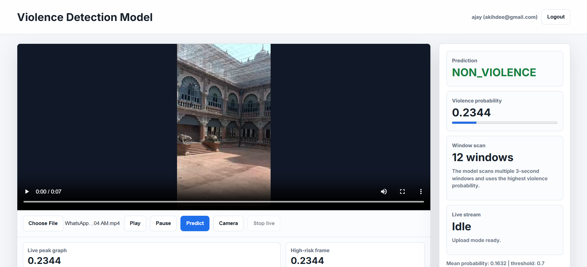
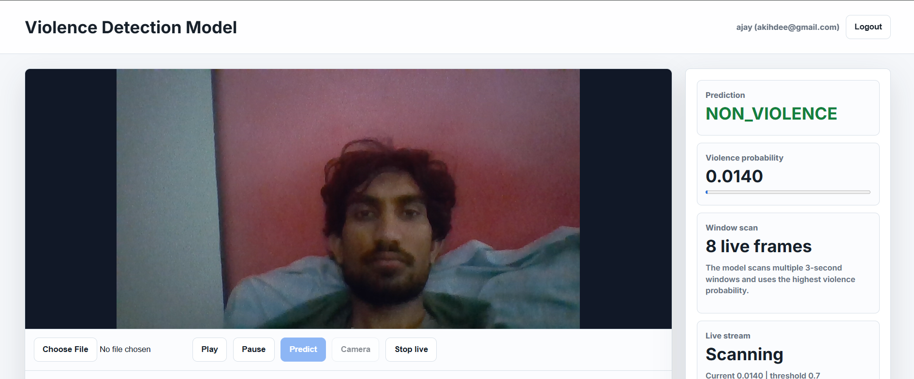
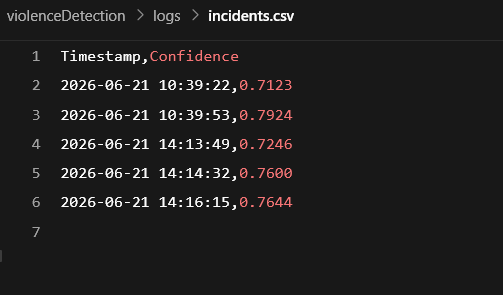

# Real-Time Violence Detection and Alert System using MobileNet-GRU

## Overview

The Real-Time Violence Detection and Alert System is an AI-powered surveillance solution designed to detect violent activities from live video streams. The system leverages a MobileNet-GRU deep learning architecture to analyze video frames and identify potentially violent situations in real time.

Upon detecting violence, the system generates alerts, records incidents, and captures evidence snapshots for further investigation. The project demonstrates the application of deep learning and computer vision in smart security and public safety systems.

---

## Key Features

* Real-time violence detection from live camera feeds
* MobileNet-GRU deep learning architecture
* Automated alert generation
* Incident logging with timestamps and confidence scores
* Automatic snapshot capture during detected incidents
* Live confidence monitoring
* Web-based user interface
* Extensible architecture for future notification systems

---

## System Architecture

```text
Live Camera Feed
        │
        ▼
Frame Extraction
        │
        ▼
MobileNet Feature Extraction
        │
        ▼
GRU Temporal Analysis
        │
        ▼
Violence Detection
        │
 ┌──────┴──────┐
 ▼             ▼
Alert       Incident Log
System      + Snapshot
```

---

## Technology Stack

### Machine Learning

* TensorFlow
* Keras
* MobileNet
* GRU (Gated Recurrent Unit)

### Computer Vision

* OpenCV

### Backend

* Python
* Flask

### Frontend

* HTML
* CSS
* JavaScript

---

## Project Structure

```text
violence-detection-mobilenet-gru/
│
├── frontend/
├── training/
├── models/
├── screenshots/
├── alerts/
├── logs/
├── docs/
│
├── README.md
├── requirements.txt
├── start_model_server.cmd
└── .gitignore
```

---

## Screenshots

### Home Page



### Live Detection



### Alert Triggered


### Incident Log



---

## Installation

### Clone Repository

```bash
git clone https://github.com/ajaylight/violence-detection-mobilenet-gru.git
cd violence-detection-mobilenet-gru
```

### Install Dependencies

```bash
pip install -r requirements.txt
```

### Start the Model Server

```bash
python training/model_server.py
```

### Run Live Detection

```bash
python training/live_alert.py
```

---

## Applications

* CCTV Surveillance
* Smart Security Systems
* Public Safety Monitoring
* Automated Incident Detection
* Campus and Workplace Security

---

## Future Enhancements

* Email Notifications
* SMS Alerts
* Multi-Camera Support
* Cloud Deployment
* Object Tracking Integration
* Security Dashboard Analytics

---

## Author

**Ajay Prakash**

Artificial Intelligence & Machine Learning Student
BNMIT, Bangalore
